# adversarial-ai-coding

`adversarial-ai-coding` is a Bash workflow for agentic software development.
One AI agent is the worker, and a second AI agent is the reviewer that reviews
the work and writes adversarial acceptance tests.

The workflow is designed around spec-first development, deterministic quality
gates, protected acceptance tests, small commits, and human review before costly
implementation starts.

The original Traditional Chinese README is available at
[`README.zh-TW.md`](README.zh-TW.md).

## How It Works

The script runs a staged workflow:

```text
Write spec             Worker writes, reviewer checks
                       Optional DUAL_SPEC=1: A/B write independent specs,
                       cross-review once, compare, then human selects owner
Final spec approval    Reviewer checks the final spec, then human approves it
Write plan             Worker creates checkbox tasks
Write acceptance tests Reviewer writes tests, worker reviews them
Implement tasks        Worker completes one checkbox task per commit
Full gate + review     Worker runs the full gate if configured, reviewer checks the branch
Final review           Worker self-reviews, reviewer gives final approval
Finish                 Script prints push and PR commands
```

The worker and reviewer can be different engines:

- `claude` for Claude Code CLI
- `codex` for Codex CLI
- `agy` for Antigravity CLI
- A custom agent CLI or wrapper command

Using different engines for worker and reviewer is recommended because their
failure modes are different.

```mermaid
flowchart TD
  subgraph S1["Stage: Write spec (owner writes / reviewer reviews)"]
    spec["spec.md includes Assumptions and Open Questions<br/>Headless AI cannot ask humans, so assumptions must be explicit."]
  end

  subgraph S2["Stage: Human approval"]
    human{"HUMAN_GATE approval<br/>Review the spec before costly implementation starts."}
  end

  subgraph S3["Stage: Write implementation plan (owner writes / reviewer reviews)"]
    plan["plan.md uses '- [ ]' checkbox tasks<br/>Each task maps to one commit."]
  end

  subgraph S4["Stage: Write acceptance tests (reviewer writes / owner reviews)"]
    tests["Adversarial TDD separates test author from worker.<br/>Protected acceptance tests may be red at first."]
  end

  subgraph S5["Stage: Implement tasks"]
    tasks["For each checkbox task:<br/>Owner implements -> lightweight build gate if configured -> protected-test diff check -> commit"]
  end

  subgraph S6["Stage: Full quality gate and branch review"]
    fullgate["Run the full quality gate if configured.<br/>Acceptance tests must pass when the gate runs."]
    branchreview["Reviewer reviews the complete branch diff."]
    fullgate --> branchreview
  end

  subgraph S7["Stage: Final review and fixes"]
    final["Owner handles accumulated suggestions and self-review findings.<br/>Run gates if configured, then reviewer performs final acceptance."]
  end

  subgraph S8["Stage: Finish"]
    finish["Print git push / gh pr create commands and run metrics.<br/>OPEN_PR=1 runs push and PR creation automatically."]
  end

  spec --> human --> plan --> tests --> tasks --> fullgate --> branchreview --> final --> finish

  style S1 fill:#ffffff,stroke:#6b7280,stroke-width:1.5px,stroke-dasharray:6 4,color:#111827
  style S2 fill:#ffffff,stroke:#6b7280,stroke-width:1.5px,stroke-dasharray:6 4,color:#111827
  style S3 fill:#ffffff,stroke:#6b7280,stroke-width:1.5px,stroke-dasharray:6 4,color:#111827
  style S4 fill:#ffffff,stroke:#6b7280,stroke-width:1.5px,stroke-dasharray:6 4,color:#111827
  style S5 fill:#ffffff,stroke:#6b7280,stroke-width:1.5px,stroke-dasharray:6 4,color:#111827
  style S6 fill:#ffffff,stroke:#6b7280,stroke-width:1.5px,stroke-dasharray:6 4,color:#111827
  style S7 fill:#ffffff,stroke:#6b7280,stroke-width:1.5px,stroke-dasharray:6 4,color:#111827
  style S8 fill:#ffffff,stroke:#6b7280,stroke-width:1.5px,stroke-dasharray:6 4,color:#111827
```



## Requirements

- Bash. On Windows, use Git Bash or WSL.
- `git`
- [`jq`](https://jqlang.github.io/jq/)
- The AI CLIs you plan to use, already installed and logged in:
  - `claude`
  - `codex`
  - `agy` is optional
- Any custom agent or wrapper commands you configure through `ENGINE_A` or
  `ENGINE_B`, available on `PATH`.
- Run the script from the root of the target Git repository.

## Quick Start

Copy the script and agent rules into the project you want to work on:

```bash
cp adversarial-ai-coding.sh AGENTS.template.md /path/to/your-project/
cd /path/to/your-project
```

Run a task with the default engines, where Claude is the worker and Codex is the
reviewer:

```bash
./adversarial-ai-coding.sh "Add --json output to the CLI"
```

You can also write the task in a file:

```bash
./adversarial-ai-coding.sh task.md
```

Swap the worker and reviewer engines:

```bash
ENGINE_A=codex ENGINE_B=claude ./adversarial-ai-coding.sh task.md
```

Use custom agent or wrapper commands:

```bash
ENGINE_A=gemini ENGINE_A_ARGS='--model gemini-2.5-pro --yolo' \
ENGINE_B=my-review-wrapper ENGINE_B_ARGS='--strict' \
  ./adversarial-ai-coding.sh task.md
```

Enable dual spec mode:

```bash
DUAL_SPEC=1 ./adversarial-ai-coding.sh task.md
```

Print the agent rules template for manual merging into an existing `AGENTS.md`:

```bash
./adversarial-ai-coding.sh print-agents
```

## Dual Spec Mode

Set `DUAL_SPEC=1` to make both slots write independent candidate specs before
implementation planning starts. The workflow becomes:

```text
A writes spec-a.md independently
B writes spec-b.md independently
B reviews A once, A reviews B once
A writes spec-comparison-a.md, B writes spec-comparison-b.md
Human chooses a, b, ma, or mb
Selected owner produces final spec.md
Other slot reviews final spec.md to approval
Human approves final spec.md
```

Decision commands:

- `a`: copy Candidate A to final `spec.md`
- `b`: copy Candidate B to final `spec.md`
- `ma`: use Candidate A as base, edit `.workflow/spec-merge-request.md`, and
  require A to adopt selected items from Candidate B
- `mb`: use Candidate B as base, edit `.workflow/spec-merge-request.md`, and
  require B to adopt selected items from Candidate A

After selection, the chosen owner remains the worker for planning,
implementation, and self-review. The other slot becomes the reviewer and writes
the protected acceptance tests. Dual spec mode requires an interactive terminal
and `HUMAN_GATE=1`; unattended runs should leave it disabled.

## Custom Engine Commands

If `ENGINE_A` or `ENGINE_B` is not `claude`, `codex`, or `agy`, the script
treats it as a custom agent command. The command is run with the slot-specific
args followed by the prompt as the final argument:

```bash
$ENGINE_A $ENGINE_A_ARGS "$prompt"
$ENGINE_B $ENGINE_B_ARGS "$prompt"
```

Custom commands must be agentic: they need to read the prompt, inspect and edit
the repository as needed, and exit non-zero on execution failure. A custom
reviewer must write `.workflow/review.md` and `.workflow/verdict.json`; stdout
JSON verdicts are not parsed. Custom engines do not get automatic session
resume, and `MODEL_A` / `MODEL_B` are not translated into model flags for them.
Put model flags in `ENGINE_A_ARGS` / `ENGINE_B_ARGS`, or use a wrapper script
for CLIs that need stdin, prompt files, quoting-sensitive arguments, or session
state.

## Writing Good Tasks

The result depends heavily on how clear the task is. Prefer a task file with a
goal, testable acceptance criteria, and explicit non-goals.

```markdown
## Goal

Add `--json` output to the CLI.

## Acceptance Criteria

- `mytool list --json` prints a valid JSON array.
- Behavior without `--json` is unchanged.

## Out of Scope

- Do not change the existing text output format.
- Do not add `--yaml`.
```

## Configuration

| Variable | Default | Description |
|---|---:|---|
| `ENGINE_A` | `claude` | Worker engine: `claude`, `codex`, `agy`, or a custom agent command. |
| `ENGINE_B` | `codex` | Reviewer engine. In the acceptance-test stage, the roles are swapped. |
| `MODEL_A` | CLI default | Model override for built-in worker slots. Custom engines should pass model flags through `ENGINE_A_ARGS`. |
| `MODEL_B` | CLI default | Model override for built-in reviewer slots. Custom engines should pass model flags through `ENGINE_B_ARGS`. |
| `CLAUDE_ARGS` / `CODEX_ARGS` / `AGY_ARGS` | empty | Extra CLI arguments for built-in engines, split on whitespace and appended to engine calls. |
| `ENGINE_A_ARGS` / `ENGINE_B_ARGS` | empty | Extra CLI arguments for custom engine commands, split on whitespace and appended before the prompt argument. |
| `MAX_ROUNDS` | `3` | Maximum review or quality-gate repair rounds per stage. |
| `HUMAN_GATE` | `1` | Pause for human approval after the spec review. Set `0` for unattended runs. |
| `DUAL_SPEC` | `0` | `1` enables the dual spec flow: A/B write independent candidates, cross-review once, produce comparison tables, and wait for human owner selection. Requires `HUMAN_GATE=1` and an interactive terminal. |
| `GATE_CMD` | auto-detected | Full quality gate. Go projects use `go build ./... && go vet ./... && go test ./...`, npm projects with a `test` script use `npm test`, Cargo projects use `cargo test`, and projects without a detected gate skip deterministic gates unless you set it. |
| `BUILD_GATE_CMD` | auto-detected | Lightweight per-task build gate. Go projects use `go build ./...`, Cargo projects use `cargo build`, and projects without a detected build gate skip this per-task gate unless you set it. |
| `AUTO_BRANCH` | `1` | Create an `auto/<timestamp>` branch before running. |
| `USE_WORKTREE` | `0` | Run in a separate Git worktree. |
| `OPEN_PR` | `0` | Push and create a GitHub PR at the end. By default, commands are only printed. |
| `NOTIFY_CMD` | empty | Notification command. The message is passed as the first argument. |
| `RETRY_ON_LIMIT` | `1` | Wait and retry on rate-limit or quota errors. |
| `RETRY_MAX` | `6` | Maximum rate-limit retries per engine call. |
| `RETRY_BASE_WAIT` | `300` | Initial exponential backoff wait, in seconds. |
| `RETRY_MAX_WAIT` | `3600` | Maximum exponential backoff wait, in seconds. |
| `AGENTS_TEMPLATE` | script directory | Path to the `AGENTS.md` template. |
| `SPEC_DIR` | `specs/<timestamp>` | Directory for `spec.md` and `plan.md`. |
| `RUNS_DIR` | `.workflow/runs` | Directory for archived workflow run artifacts. |
| `TOOLS` | git/go build/test/vet allowlist | Claude Code `--allowedTools` value. |

On Windows, if you want Go race tests in the gate, use:

```bash
GATE_CMD='go build ./... && go vet ./... && go test -race -ldflags "-extldflags=-Wl,--default-image-base-low" ./...' \
  ./adversarial-ai-coding.sh task.md
```

## Artifacts

The script writes live workflow state under `.workflow/` and archives each run
under `.workflow/runs/<RUN_ID>/` by default.

```text
your-project/
|-- AGENTS.template.md
|-- AGENTS.md
|-- CLAUDE.md
|-- specs/<RUN_ID>/
|   |-- spec-a.md                    # DUAL_SPEC=1 candidate from slot A
|   |-- spec-b.md                    # DUAL_SPEC=1 candidate from slot B
|   |-- spec-a.review-by-b.md        # DUAL_SPEC=1 one-shot candidate review
|   |-- spec-b.review-by-a.md        # DUAL_SPEC=1 one-shot candidate review
|   |-- spec-comparison-a.md         # DUAL_SPEC=1 comparison from slot A
|   |-- spec-comparison-b.md         # DUAL_SPEC=1 comparison from slot B
|   |-- spec-comparison.md           # DUAL_SPEC=1 human decision index
|   |-- spec-decision.md             # DUAL_SPEC=1 selected owner/reviewer
|   |-- spec.md
|   `-- plan.md
|-- .workflow/
|   |-- review.md
|   |-- verdict.json
|   |-- suggestions.md
|   |-- spec-merge-request.md        # DUAL_SPEC=1 merge-adoption instructions
|   |-- protected-tests.txt
|   |-- protected-base.sha
|   |-- pr-body.md
|   |-- latest-run.txt
|   `-- runs/<RUN_ID>/
|       |-- 001-run-metadata.json
|       |-- 002-task-source.md
|       |-- 003-task.txt
|       |-- NNN-*-prompt.md
|       |-- NNN-*-output.txt
|       |-- NNN-*-attempt-*-rc*.raw
|       |-- NNN-review-*.md
|       |-- NNN-verdict-*.json
|       |-- NNN-*-git-status.txt
|       |-- NNN-*-git-diff.patch
|       |-- metrics.csv
|       `-- logs/001-run.log
`-- adversarial-ai-coding.sh
```

Each archived artifact has a `.meta.json` sidecar with generator, engine, model,
stage, round, run id, and timestamp data.

## Protected Acceptance Tests

Acceptance tests are written by the reviewer and then protected. During
implementation, the worker must not edit, delete, or skip files listed in
`.workflow/protected-tests.txt`.

If a protected test is wrong, stop and handle it manually. A human can edit the
test and update `.workflow/protected-base.sha`, or remove the file from
`.workflow/protected-tests.txt`.

## Safety Notes

- Deterministic gates are run by the script, not trusted from AI output.
- `agy` currently uses `--dangerously-skip-permissions`; prefer a worktree or
  container when using it.
- Branches and worktrees isolate Git state, but they do not isolate the full
  filesystem or network. Use a container for stronger isolation.
- Two AI agents can consume a lot of quota. `MAX_ROUNDS`, graded verdicts, and
  `commit_if_dirty` are designed to limit waste.
- Dual spec mode adds extra AI calls for the second candidate, candidate
  reviews, and comparison tables. Keep it off unless the spec decision is
  worth the extra cost.
- `DUAL_SPEC=1` intentionally refuses `HUMAN_GATE=0` and non-interactive
  terminals because the workflow requires a human owner decision.
- `codex`, `agy`, and identical custom engine commands cannot be used as both
  worker and reviewer at the same time. Use distinct wrapper command names when
  both slots share the same underlying custom CLI.

## Testing This Repository

Run helper tests. These do not call any AI engine:

```bash
bash tests/helpers.test.sh
```

Run the manual E2E fixture setup without calling AI:

```bash
E2E_SETUP_ONLY=1 bash tests/e2e/run.sh
```

Run the full E2E only when changing core workflow behavior. It calls real AI
engines and consumes quota:

```bash
bash tests/e2e/run.sh
```

On Windows, if Go cannot initialize its default build cache from Git Bash, set a
writable cache path:

```bash
export GOCACHE=/tmp/go-build-aac
```

## Troubleshooting

### Reviewer did not write `verdict.json`

The reviewer failed or did not follow the rules. For custom reviewers, verify
that the command can write `.workflow/review.md` and `.workflow/verdict.json`.
Check `.workflow/logs/` or the run archive under `.workflow/runs/<RUN_ID>/`.

### The run is stuck on a permission prompt

Headless mode cannot answer permission prompts. For Claude Code, add required
commands to `TOOLS`. For Codex, check sandbox settings. For Antigravity, check
its permission flags and isolation.

### No interactive terminal is available for approval

`HUMAN_GATE=1` requires a TTY. In unattended environments, set `HUMAN_GATE=0`
and use `NOTIFY_CMD` or PR review for human control.

### The per-task quality gate keeps failing

During task implementation, full acceptance tests may still be red. When
configured, the script uses `BUILD_GATE_CMD` for per-task checks and `GATE_CMD`
after all tasks finish.

### Reviewer reports corrupted files on Windows

Some AI tools may misdecode non-ASCII UTF-8 content on Windows. Keep generated
specs, plans, and test data ASCII when possible. Represent non-ASCII source
test data with Unicode escapes, as described in `AGENTS.template.md`.

### Rate limit or quota errors

By default, the script waits and retries on rate-limit or quota errors. Set
`RETRY_ON_LIMIT=0` to fail immediately.

## Related Reading

- [Claude Code headless mode](https://code.claude.com/docs/en/headless)
- [Codex CLI non-interactive mode](https://developers.openai.com/codex/noninteractive)
- [Codex CLI reference](https://developers.openai.com/codex/cli/reference)
- [GitHub Spec Kit](https://github.com/github/spec-kit)
