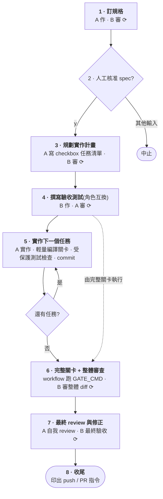
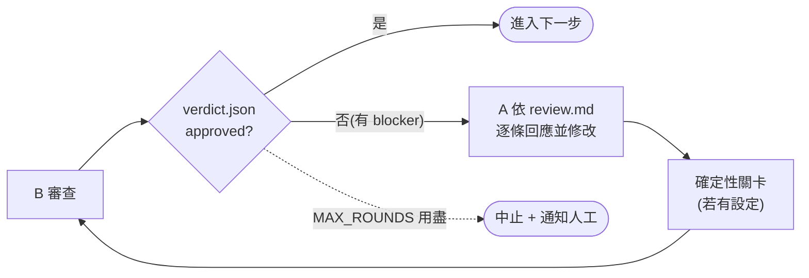

# adversarial-ai-coding — 雙 AI 對抗式程式開發工作流

用 Python CLI 自動化「A 實作、B 對抗式審查與驗收測試」的開發流程,以 SDD 規格先行與對抗式驗收測試驅動開發為主軸,並依 2026 年 agentic 開發的最佳實踐強化:確定性品質關卡、人工檢查點、分級裁決。對應的原始工作流:

```bash
for work in "訂規格" "規劃實作計畫" "撰寫程式碼" "整體review" "修bug"; do
  用 A 做 $work
  上個步驟的成果交給 B review
  讓 A 確認 review 結果後修改
  要求 B 做最後確認
done
```

其中 A(工作者 agent)與 B(審查者 agent)可以是 **Claude Code CLI**、**Codex CLI** 或 **Antigravity CLI**,透過各家的 headless(非互動)模式驅動。

## 流程

流程圖中標 ⟳ 的步驟都會執行同一個審查迴圈,見第二張圖。



⟳ 審查迴圈是同一顆可重用的積木;迴圈何時結束由 workflow 決定,不由 AI 說了算:



確定性關卡是由 workflow 親自執行的 shell 指令,AI 的「測試通過」回報不被採信。共兩個:`GATE_CMD` 是完整關卡(build、vet 與全部測試,包含驗收測試);`BUILD_GATE_CMD` 是逐任務的輕量關卡(只驗編譯)。未設定關卡指令的 stage 會跳過該步。

各 stage 說明:

1. **訂規格**:`spec.md` 必含「假設與未決問題」——headless 下 AI 不能問人,禁止默默腦補。`DUAL_SPEC=1` 時 A/B 先各寫一份獨立候選 spec,見[雙 spec 模式](#雙-spec-模式)。
2. **人工核准**:最高槓桿的人工檢查點——人核准 spec(可先直接編輯,改動會一併 commit)後,才開始花大錢實作。無人值守用 `HUMAN_GATE=0` 跳過。
3. **規劃實作計畫**:`plan.md` 必須是「- [ ] 」checkbox 任務清單,一個任務對應一個 commit。
4. **撰寫驗收測試**:對抗式 TDD 讓出題者與答題者分離,所以角色互換:B 寫測試、A 只負責審。測試檔隨後受保護,之後每次工作者動作後 workflow 都用 `git diff` 硬性檢查;此階段紅燈是預期的(TDD red phase)。詳細機制與「測試真的錯了怎麼辦」見[受保護測試的逃生口](#受保護測試的逃生口)。
5. **逐任務實作**:一個 checkbox 任務一個 commit,審查與回退都容易。逐任務只跑輕量的 `BUILD_GATE_CMD`(只驗編譯);所有任務完成前,驗收測試允許紅燈。
6. **完整關卡 + 整體審查**:workflow 親自跑 `GATE_CMD`,此時驗收測試必須全綠;接著 B 審整條 branch 的完整 diff。
7. **最終 review 與修正**:A 逐條處理累積的 `.workflow/suggestions.md` 與自我 review 發現,B 做最終驗收。
8. **收尾**:印出 `git push` / `gh pr create` 指令與執行統計;`OPEN_PR=1` 才自動執行。

分級裁決(只有 blocker 擋關、suggestions 累積後評估)的機制與理由見下一節「核心設計」。

## 核心設計(為什麼這樣做)

- **確定性關卡不外包給 AI**:AI 會為了「讓測試通過」走捷徑(reward hacking),所以 build/vet/test 由 workflow 自己跑,失敗輸出直接餵回給工作者修;AI 的「測試通過」回報只當參考。
- **對抗式測試完整性**:驗收測試由審查方(B)依規格撰寫、工作方(A)審查;實作階段 A 禁改這些測試檔,workflow 在**每次工作者動作後**用 `git diff` 硬性檢查(已提交與未提交的竄改都抓),屢犯即中止。對測試有異議只能記錄在 spec 的「假設與未決問題」。
- **人工檢查點在最高槓桿處**:spec 通過 AI 互審後、開始花大錢實作前,暫停等人核准(可先直接編輯 spec 再繼續);流程終點是「等人 merge 的 PR」,不是靜默結束。
- **分級裁決**:`verdict.json` 為 `{approved, blockers[], suggestions[]}`,只有 blocker 擋關;suggestions 累積到 `.workflow/suggestions.md`,收尾階段逐條評估,避免審查者拿小事擋關或不好意思擋而放水。
- **小批次**:一個 checkbox 任務一個 commit,審查與回退都容易。
- **產物落地成檔案**:A/B 之間靠 `specs/` 檔案與 git diff 溝通,不靠 stdout 傳遞長內容——這是 SDD 的天然優勢。
- **A 同 stage 續 session、B 每輪全新 context**:A 修改時記得自己為什麼那樣寫;B 不被前一輪結論定錨——這也是 A/B 用不同廠牌模型互審的價值(盲點不同)。

## 前置需求

- Python 3.12 以上
- [Astral uv](https://docs.astral.sh/uv/)
- `git`
- 會用到的 AI CLI 已安裝並登入:`claude`(Claude Code)、`codex`(Codex CLI)、`agy`(Antigravity CLI,選用)
- **在目標專案的 git repo 根目錄執行**(workflow 會檢查)。不需要 Bash 或 `jq`

## 快速開始

```bash
# 先在 workflow checkout 安裝鎖定的環境
cd /path/to/adversarial-ai-coding
uv sync --frozen

# 再從目標專案根目錄執行
cd /path/to/your-project
AAC_PROJECT=/path/to/adversarial-ai-coding

# 預設:A = Claude Code,B = Codex
uv run --project "$AAC_PROJECT" --locked adversarial-ai-coding "為 CLI 加上 --json 輸出選項"

# 任務描述寫成檔案(建議,見下方「任務怎麼寫」)
uv run --project "$AAC_PROJECT" --locked adversarial-ai-coding task.md

# 交換 agent
AGENT_A=codex AGENT_B=claude uv run --project "$AAC_PROJECT" --locked adversarial-ai-coding task.md

# 啟用雙 spec 模式(需要互動終端與 HUMAN_GATE=1)
DUAL_SPEC=1 uv run --project "$AAC_PROJECT" --locked adversarial-ai-coding task.md

# 輸出 AGENTS.md 規範範本(給已有 AGENTS.md 的專案手動合併)
uv run --project "$AAC_PROJECT" --locked adversarial-ai-coding print-agents
```

若目標就是 workflow checkout 本身,可使用簡寫:`uv run adversarial-ai-coding task.md`。

## 雙 spec 模式

設定 `DUAL_SPEC=1` 後,規格階段會改成:

```text
A 獨立寫 spec-a.md
B 獨立寫 spec-b.md
B 對 A 候選審一次,A 對 B 候選審一次
A 寫 spec-comparison-a.md,B 寫 spec-comparison-b.md
人類選 a、b、ma 或 mb
選定 owner 產出最終 spec.md
另一方用既有 review_loop 將最終 spec 審到通過
人類核准最終 spec.md 後才開始 plan
```

裁決命令:

- `a`:直接複製 A 的候選成最終 `spec.md`
- `b`:直接複製 B 的候選成最終 `spec.md`
- `ma`:以 A 為 base,編輯 `.workflow/spec-merge-request.md`,要求 A 明確採納 B 的指定項目
- `mb`:以 B 為 base,編輯 `.workflow/spec-merge-request.md`,要求 B 明確採納 A 的指定項目

被選中的 owner 後續負責 plan、實作與自我 review;另一方成為 reviewer,並負責撰寫受保護驗收測試。此模式預設關閉,且刻意要求互動終端與 `HUMAN_GATE=1`;無人值守流程請維持 `DUAL_SPEC=0`。

### 任務怎麼寫

結果好壞幾乎取決於任務範圍是否明確、「完成」是否可驗證。建議用檔案 + 這個格式:

```markdown
## 目標
為 CLI 加上 --json 輸出選項。

## 驗收條件
- `mytool list --json` 輸出合法 JSON 陣列
- 沒有 --json 時行為完全不變

## 不做什麼
- 不改既有的文字輸出格式
- 不處理 --yaml
```

## 環境變數

| 變數 | 預設值 | 說明 |
|---|---|---|
| `AGENT_A` | `claude` | 工作者 agent command:`claude` \| `codex` \| `agy` 或自訂命令 |
| `AGENT_B` | `codex` | 審查者 agent command(驗收測試 stage 兩者角色互換) |
| `MODEL_A` | (CLI 預設) | A 槽內建 agent 的模型,例 `haiku`、`gpt-5.1-codex-mini`;便宜任務/試跑時控制成本用。自訂 agent 請把模型參數放在 `AGENT_A_ARGS` |
| `MODEL_B` | (CLI 預設) | B 槽內建 agent 的模型;A、B 同為 claude 時以 `MODEL_A` 為準。自訂 agent 請把模型參數放在 `AGENT_B_ARGS` |
| `CLAUDE_ARGS` / `CODEX_ARGS` / `AGY_ARGS` | (空) | 各內建 agent CLI 的額外參數,依空白切割後附加。例:`CODEX_ARGS='-c model_reasoning_effort=low'`(ChatGPT 訂閱帳號無 mini 模型,降 reasoning effort 是主要省錢手段) |
| `AGENT_A_ARGS` / `AGENT_B_ARGS` | (空) | 自訂 agent command 的額外參數,依空白切割後加在 prompt-file instruction 前 |
| `MAX_ROUNDS` | `3` | 每個 stage 的審查/關卡最多輪數,超過即通知並中止 |
| `HUMAN_GATE` | `1` | spec 通過 AI 互審後暫停等人核准;無人值守設 `0`(不建議) |
| `DUAL_SPEC` | `0` | `1` = 啟用雙 spec: A/B 各寫獨立候選、互審一次、各寫比較表、等人選 owner。需要互動終端與 `HUMAN_GATE=1` |
| `GATE_CMD` | 自動偵測 | 完整品質關卡。go:`go build ./... && go vet ./... && go test ./...`;npm(有 test script):`npm test`;cargo:`cargo test`;偵測不到則停用並警告 |
| `BUILD_GATE_CMD` | 自動偵測 | 逐任務的輕量關卡(只驗編譯,容忍驗收測試紅燈) |
| `AUTO_BRANCH` | `1` | 自動建立 `auto/<時間戳>` branch |
| `USE_WORKTREE` | `0` | `1` = 在獨立 git worktree 執行(隔離性比 branch 好) |
| `OPEN_PR` | `0` | `1` = 結尾自動 push 並 `gh pr create`(需 gh 與 origin);預設只印指令 |
| `NOTIFY_CMD` | (空) | 通知指令,訊息以第一個參數傳入,例:`NOTIFY_CMD="ntfy publish mytopic"`。觸發點:待人工核准、各種中止、限額等待、完成 |
| `RETRY_ON_LIMIT` | `1` | 撞用量限額/429 時自動等待重試,三個內建 agent 通用。能解析等待時間就精準等(claude 的 `resets HH:MMam` +2 分緩衝;codex 的 `try again in 90s`、`try again at Jul 14th, 2026 7:23 PM` 或只有時刻的 `try again at 12:50 AM` +30 秒緩衝),否則指數退避;`0` = 直接失敗 |
| `RETRY_MAX` | `6` | 每次 agent 呼叫的限額重試上限 |
| `RETRY_BASE_WAIT` | `300` | 指數退避的初始等待秒數(每次 ×2) |
| `RETRY_MAX_WAIT` | `3600` | 指數退避的單次等待上限(秒) |
| `RETRY_MAX_RESET_WAIT` | `21600` | 訊息中的重置時刻若比這個秒數還遠(如週配額要等好幾天),立即放棄而不空等 |
| `RESUME_RUN` | (空) | 續跑中斷的 run:填 `.workflow/state/` 下的 run id,或 `last` 取最新未完成的 run。已完成 stage 直接跳過。詳見「中斷後續跑」 |
| `AGENTS_TEMPLATE` | workflow checkout 內的 `resources/AGENTS.template.md` | AGENTS.md 規範範本路徑;範本遺失時 bootstrap 會警告並跳過(流程照常) |
| `PROMPTS_DIR` | workflow checkout 內的 `resources/prompts` | workflow prompt template 目錄;除非要覆寫內建 prompt,通常不用設定 |
| `SPEC_DIR` | `specs/<時間戳>` | 規格與計畫的存放目錄 |
| `RUNS_DIR` | `.workflow/runs` | 每次 run 的 archive 根目錄;相對路徑會在 branch/worktree 準備完成後解析 |
| `TOOLS` | git/go test/go build/go vet | Claude Code 的 `--allowedTools` 白名單。**注意 `Bash(go *)` 含 `go run`(任意程式碼執行),別圖方便放寬**。審查者同受白名單限制,被擋的指令會空轉燒 token(E2E 實測):依專案補上常用唯讀指令(如 `Bash(gofmt *)`),並靠 AGENTS.md 的規則引導 agent 改用內建檔案工具 |

Windows 上想在關卡跑 `-race`:`GATE_CMD='go build ./... && go vet ./... && go test -race -ldflags "-extldflags=-Wl,--default-image-base-low" ./...'`

## 中斷後續跑

每次 run 會把進度記錄在 `.workflow/state/<run-id>/`:resolved task 快照、生效設定、stage 完成台帳、write-code 剩餘任務佇列。run 中止時會印出可直接貼上的續跑指令:

```bash
RESUME_RUN=20260710-153012 uv run --project "$AAC_PROJECT" --locked adversarial-ai-coding
```

續跑會跳過所有已完成的 stage(不重付 AI 費用),還原跨 stage 狀態(dual-spec 裁決、驗收測試基準、剩餘實作任務),從中斷點繼續。`RESUME_RUN=last` 自動選最新未完成的 run。續跑不必再帶 task 參數:以 run 的 task 快照為準,帶了且內容不同會直接拒絕。

引擎、模型等多數設定每次 attempt 都可覆寫。最主要的用例是換掉配額耗盡的 agent:

```bash
AGENT_B=agy RESUME_RUN=last uv run --project "$AAC_PROJECT" --locked adversarial-ai-coding
```

`SPEC_DIR`、`DUAL_SPEC`、`AUTO_BRANCH`、`USE_WORKTREE` 跨續跑不可變:它們決定 stage 圖與產物位置,衝突的覆寫會被拒絕。`NOTIFY_CMD` 刻意不持久化,每次 attempt 重新提供。

保證範圍:

| 中斷類型 | 行為 |
|---|---|
| 可捕捉中止:agent 失敗、配額耗盡(exit code 75)、審查/關卡輪次用盡、人工中止、受保護測試中止、Ctrl-C / SIGTERM / SIGHUP | 印一次續跑指令並保留原 exit code;續跑從最後完成的 stage 之後繼續 |
| SIGKILL、斷電、OS 當機 | Best effort。狀態為 append-only、失敗方向 fail-safe:最壞情況是多重跑一兩個 stage(多付一點 AI 費用),不會錯誤跳過未完成的工作 |
| state 目錄或 worktree 被刪、branch 歷史被 rewrite | Fail closed 並給出明確訊息,不做透明恢復 |

注意事項:

- `USE_WORKTREE=1` 的 run,state 在 worktree 的 `.workflow/` 內;必須 cd 進該 worktree 執行續跑(印出的提示已含 `cd` 指令)。
- attempt 異常死亡可能留下 stale lock;錯誤訊息會給出確認前次已死後手動清除 `.workflow/state/<run-id>/lock` 的指令。
- 已完成的 run 拒絕續跑;`RESUME_RUN=last` 會自動略過已完成的 run。

## 產物與目錄結構

```
adversarial-ai-coding/
├── pyproject.toml
├── src/adversarial_ai_coding/
└── resources/
    ├── AGENTS.template.md   # 互審規範範本(簡單英文撰寫,對各家模型最通用)
    └── prompts/
        └── *.md             # workflow prompt templates

your-project/
├── AGENTS.md            # 互審規範(缺檔時由範本產生;既有檔案絕不覆蓋,只提示)
├── CLAUDE.md            # 缺檔時補一行指向 AGENTS.md
├── specs/<RUN_ID>/
│   ├── spec-a.md                    # DUAL_SPEC=1 時 A 的候選 spec
│   ├── spec-b.md                    # DUAL_SPEC=1 時 B 的候選 spec
│   ├── spec-a.review-by-b.md        # DUAL_SPEC=1 時 B 對 A 的 one-shot review
│   ├── spec-b.review-by-a.md        # DUAL_SPEC=1 時 A 對 B 的 one-shot review
│   ├── spec-comparison-a.md         # DUAL_SPEC=1 時 A 寫的比較表
│   ├── spec-comparison-b.md         # DUAL_SPEC=1 時 B 寫的比較表
│   ├── spec-comparison.md           # DUAL_SPEC=1 時給人看的裁決索引
│   ├── spec-decision.md             # DUAL_SPEC=1 時記錄選定 owner/reviewer
│   ├── spec.md          # 規格(含驗收條件、假設與未決問題)
│   └── plan.md          # 實作計畫(checkbox 任務清單,完成會打勾)
├── .workflow/           # 不進版控(workflow 自動放 .gitignore)
│   ├── review.md        # B 的審查意見 + A 的逐條回覆
│   ├── verdict.json     # 裁決:{approved, blockers[], suggestions[]}
│   ├── suggestions.md   # 歷輪累積的不擋關建議(收尾階段逐條評估)
│   ├── spec-merge-request.md        # DUAL_SPEC=1 merge 時的人類採納指示
│   ├── protected-tests.txt / protected-base.sha   # 受保護測試檔清單與基準 commit
│   ├── pr-body.md       # 收尾產生的 PR 內文
│   ├── latest-run.txt   # 指向最近一次 run archive 目錄
│   ├── state/<RUN_ID>/  # 續跑狀態:設定快照、stage 台帳、任務佇列(RESUME_RUN 用)
│   └── runs/<RUN_ID>/   # 每次 run 的完整中間資料 archive
│       ├── 001-run-metadata.json
│       ├── 002-task-source.md / 003-task.txt
│       ├── NNN-*-prompt.md / NNN-*-output.txt / NNN-*-attempt-*-rc*.raw
│       ├── NNN-review-*.md / NNN-verdict-*.json
│       ├── NNN-*-git-status.txt / NNN-*-git-diff.patch
│       ├── metrics.csv  # stage/角色/engine欄位/輪次/秒數/費用/model/args/time
│       └── logs/001-run.log (+ 001-run.log.meta.json)
```

Archive 產物檔名前綴 `NNN-` 是單一 run 內的生成順序;每個 artifact 會有對應 `.meta.json`,記錄生成時間、角色、`engine`、模型與模型參數。`engine` 是為了相容既有 archive schema 而保留的穩定欄位,記錄該次呼叫實際解析出的 agent command/runtime。`metrics.csv` 的前 7 欄維持 `run_id,stage,role,engine,round,duration_s,cost_usd`,尾端追加 model/model_args/generated_at;費用目前只有 claude agent 會回報(`total_cost_usd`)。

## Agent CLI 差異與限制

| | claude | codex | agy |
|---|---|---|---|
| 非互動執行 | `claude -p` | `codex exec` | `agy --print` |
| session 續接 | `--resume <id>`(精準) | `resume --last`(取最近一次) | `--continue`(取最近一次) |
| 權限控制 | `acceptEdits` + `TOOLS` 白名單 | `--sandbox workspace-write` | `--dangerously-skip-permissions`(見安全性) |
| 費用回報 | 有(metrics.csv) | 無 | 無 |

- **A 與 B 不能同時是 `codex` 或同時是 `agy`**:兩者都以「最近一次 session」續接,互審會讓工作者續接到審查者的對話,workflow 直接擋下。
- `codex exec resume` 沒有 `--sandbox` 旗標,workflow 改用 `-c 'sandbox_mode="workspace-write"'`。
- agy 的 `--print-timeout` 預設僅 5 分鐘,workflow 已調高(工作 60 分、審查 30 分)。
- 各 CLI 旗標以本機 `--help` 為準(本 workflow 依 2026-07 版本撰寫)。

## 受保護測試的逃生口

工作者(A)對驗收測試有異議時,只能把異議寫進 spec 的「假設與未決問題」,不能改測試。若測試**真的**錯了,由人工介入:直接編輯測試檔(人不受 workflow 限制,下一輪檢查比對的是「工作者動作後」的 diff——但注意人工改動會讓比對基準失真,建議改完後把新內容 commit 並更新 `.workflow/protected-base.sha` 為新的 commit SHA),或從 `.workflow/protected-tests.txt` 移除該檔。

## 安全性注意事項

- **agy agent 使用 `--dangerously-skip-permissions`**(該 CLI 無細粒度白名單),只建議搭配 `USE_WORKTREE=1` 或容器使用。
- claude / codex 都以最小權限運作;真正的完整隔離是容器(devcontainer),branch/worktree 只隔離 git 狀態,不隔離檔案系統與網路。
- 兩個 AI 互審**很燒 token**:`MAX_ROUNDS`、分級裁決、`commit_if_dirty`(無變更就跳過 commit 呼叫)都是止損機制。中止時已通過的 stage 均已 commit,可從斷點人工接手。
- 雙 spec 模式會多花第二份候選、互審與比較表的 AI 呼叫;只有在規格決策值得額外成本時再開。
- `DUAL_SPEC=1` 會拒絕 `HUMAN_GATE=0` 與無互動終端,因為此流程必須由人選定最終 spec owner。

## 自訂 stage

Stage 流程定義在 `workflow.run_workflow()` 內,由 `begin_stage`、`work`、`review_loop`、`gate_loop`、`commit_work` / `commit_if_dirty` 等 Python 積木組成。照現有 stage 的樣式增刪即可。

## 測試

```bash
uv run pytest -q   # 單元與整合測試,不呼叫任何 AI
```

### 手動 E2E(會呼叫真實 AI、消耗訂閱配額)

```bash
uv run pytest -m e2e -s   # 完整六 stage(預設 sonnet worker/low effort + codex gpt-5.5/low effort;約 20~40 分、$2~5 等值配額)
```

執行器在臨時目錄現生 fixture git repo(Go 小專案 + ASCII 任務書,沉澱自五次真實試跑的教訓),直接引用本 repo 的 Python 套件與 `resources/`(無複本漂移),跑完後自動驗收:六 stage 完成、spec 含 Assumptions 節、plan checkbox 全打勾、受保護測試未被改動、逐任務小 commit、最終關卡由執行器親測、metrics 摘要。成敗都會保留現場路徑供檢視,`E2E_DIR` 可指定位置,agent 與模型可用一般環境變數覆寫。

**定位:改動 workflow 核心邏輯後、發版前的手動回歸;絕不掛進 CI 或單元測試入口。**

## 疑難排解

- **`(B 未產出 verdict.json,視為未通過)`**:審查者 agent 失敗或沒照規範寫檔,看 `.workflow/logs/`;連續發生會被 `MAX_ROUNDS` 擋下並通知。
- **卡在權限詢問**:headless 下沒人能按「允許」。Claude Code 需要的指令加進 `TOOLS`;codex 確認 sandbox 模式;agy 確認旗標。
- **`沒有互動終端可供核准`**:`HUMAN_GATE=1` 需要 tty;在 CI 等無人環境設 `HUMAN_GATE=0`,並用 `NOTIFY_CMD` 接手把關。
- **品質關卡在逐任務階段一直紅**:驗收測試在所有任務完成前本來就允許紅燈,逐任務只跑 `BUILD_GATE_CMD`(編譯);若連編譯關卡都過不了才會進修正迴圈。
- **審查者報告檔案「損壞」但檔案其實正常**:Windows(特別是中文語系)上 codex 讀檔可能把 UTF-8 內容用系統碼頁(CP950)解碼成亂碼,產生假性 corruption blocker。對策:規格、計畫與測試資料盡量用 ASCII,非 ASCII 字元寫成 Unicode escape(Go 中即反斜線接 `u4e0a`,代表 U+4E0A「上」)——AGENTS.md 範本已內建此規則。
- **撞到訂閱用量限額**(`You've hit your session limit`、`You've hit your usage limit`、429):預設會自動等待重試,三個 agent 通用。訊息若寫明等待時間就精準等(支援 `resets 10:50am`、`try again in 90s`、`try again at Jul 14th, 2026 7:23 PM`、只有時刻的 `try again at 12:50 AM` 四種格式,即使被換行折斷也能解析),否則指數退避;等待會發 `NOTIFY_CMD` 通知並記錄在 log。
  **若重置時刻比 `RETRY_MAX_RESET_WAIT`(預設 6 小時)還遠**——例如 codex 週配額要等好幾天——則立即放棄並印出重置時刻,不做徒勞的空等;配額回來後重跑即可。`RETRY_ON_LIMIT=0` 可完全關閉重試。非限額的 agent 失敗不會重試,原始輸出攤印在 log 結尾供診斷。

## 延伸方向

- **進一步的 agent 整合**:[Claude Agent SDK](https://code.claude.com/docs/en/agent-sdk/overview)(Python/TS)是 `claude -p` 的程式化介面,原生支援 structured output、session 物件、工具核准 callback。
- **規格模板**:前兩個 stage 可搭配 [GitHub spec-kit](https://github.com/github/spec-kit) 的 SDD 產物格式。
- **CI 無人值守**:`HUMAN_GATE=0 OPEN_PR=1` + `NOTIFY_CMD`,人改在 PR 上把關;Claude Code 與 Codex 都有官方 CI 整合。

## 參考資料

- [Run Claude Code programmatically(官方 headless 文件)](https://code.claude.com/docs/en/headless)
- [Codex CLI Non-interactive mode(官方)](https://developers.openai.com/codex/noninteractive)
- [Codex CLI reference(官方)](https://developers.openai.com/codex/cli/reference)
- [Beyond Autocomplete: Best Agentic Coding Workflow in 2026(Kilo)](https://kilo.ai/articles/beyond-autocomplete)
- [How to evaluate AI agents, avoid reward hacking, and build better specs(Arize)](https://arize.com/blog/how-to-evaluate-ai-agents-and-build-better-specs)
- [Spec-Driven Development: A Spec-First Approach to AI-Native Engineering(Microsoft)](https://developer.microsoft.com/blog/spec-driven-development-ai-native-engineering)
