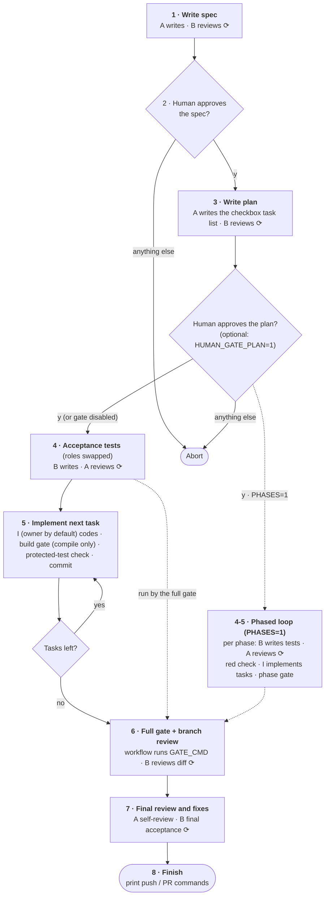
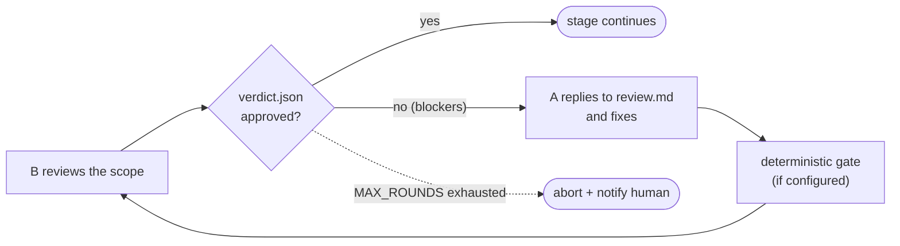

# How It Works — Stage-by-Stage Details

This is the detailed companion to the
[How It Works](../README.md#how-it-works) overview in the README: the complete
pipeline diagram, the review-loop mechanics, and per-stage notes.

The workflow drives two owner/reviewer slots through a staged pipeline: `A` is
the worker agent and `B` is the reviewer agent. Stage 5 can also use a separate
implementation slot, `I`. Any slot can resolve to:

- `claude` for Claude Code CLI
- `codex` for Codex CLI
- `agy` for Antigravity CLI
- A custom agent CLI or wrapper command

Using different agent commands for worker and reviewer is recommended because their
failure modes are different.

Every step marked ⟳ in the pipeline runs the same review loop, shown in the
second diagram.

The ⟳ review loop is one reusable building block. The workflow, not the AI,
decides when the loop ends:

A deterministic gate is a shell command the workflow runs itself instead of
trusting the AI's "tests pass" claims. There are two: `GATE_CMD` is the full
gate (build, vet, and every test, including the acceptance tests), and
`BUILD_GATE_CMD` is the lightweight per-task gate (compile only). Stages
without a configured gate command skip that step.

Stage notes:

1. **Write spec**: `spec.md` must include an Assumptions and Open Questions
   section, because headless AI cannot ask humans and silent guessing is
   forbidden. With `DUAL_SPEC=1`, A and B write independent candidate specs
   first; see [Dual Spec Mode](../README.md#dual-spec-mode).
2. **Human approval**: the highest-leverage checkpoint. A bad spec amplifies
   into many bad changes, so a human approves the spec (and may edit it first)
   before costly implementation starts. `HUMAN_GATE=0` skips this gate.
3. **Write plan**: `plan.md` must be a `- [ ]` checkbox task list. Each task
   maps to one commit. `HUMAN_GATE_PLAN=1` adds a second human checkpoint
   here, after the review and before the plan is committed: the plan is the
   task queue, so it is the last cheap place to intervene. Off by default;
   like the spec gate, you may edit `plan.md` first and your edits are
   committed with it.
4. **Acceptance tests**: adversarial TDD separates the test author from the
   implementer, so the roles swap: B writes the tests and A only reviews them.
   The test files become protected; the workflow hard-checks them with
   `git diff` after every later worker action. Red tests are expected here
   (TDD red phase). See
   [Protected Acceptance Tests](../README.md#protected-acceptance-tests) for
   details and the escape hatch when a protected test is wrong.
5. **Implement tasks**: one checkbox task per commit keeps review and rollback
   small. The implementation slot handles the whole per-task loop: implementing
   the task, repairing `BUILD_GATE_CMD` failures, repairing protected-test
   violations, and making that task's commit. With no `IMPL_*` setting, this
   slot is exactly the owner and behavior is unchanged. The per-task gate is
   lightweight (compile only), so acceptance tests may stay red until all tasks
   are done. After the loop, the normal owner/reviewer pairing resumes: the
   owner handles full-`GATE_CMD` repairs, branch-review fixes, and final-review
   fixes, while the reviewer performs branch review and final acceptance.
6. **Full gate + branch review**: the workflow itself runs `GATE_CMD` — the AI's
   own "tests pass" claim is never trusted — and acceptance tests must pass
   now. B then reviews the complete branch diff.
7. **Final review and fixes**: A works through the accumulated
   `.workflow/suggestions.md` items and its own self-review findings, then B
   gives final acceptance.
8. **Finish**: the workflow prints `git push` / `gh pr create` commands and run
   metrics. `OPEN_PR=1` runs them automatically.

Review verdicts are graded. `verdict.json` is
`{approved, blockers[], suggestions[]}`: only blockers make the loop repeat,
while suggestions accumulate in `.workflow/suggestions.md` and are handled in
stage 7. This keeps a reviewer from blocking on nitpicks or approving just to
be polite.
