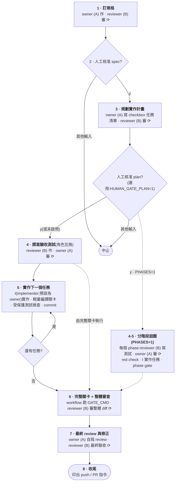
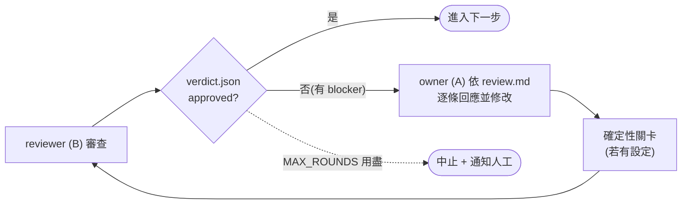

# 流程 — 逐 stage 完整說明

本文件是 [README 流程總覽](../README.zh-TW.md#流程)的完整版:完整流程圖、審查迴圈機制與各 stage 細節。跨越 agent 邊界的每個檔案(verdict、review、spec、plan、受保護測試與 run state)的規範參考見 [artifact-contract.zh-TW.md](artifact-contract.zh-TW.md)。

流程驅動兩個固定 slot:`A` 與 `B`。預設 A 是 owner,B 是 reviewer。Stage 5 還可使用獨立實作 slot `I`(implementer;未設 `IMPL_*` 時就是 owner)。**worker 呼叫**是任何一次會改檔的 agent 呼叫,不是職稱。Dual Spec 可以重綁 owner/reviewer,slot 名稱仍是 A 與 B。下方圖使用預設對照(A = owner,B = reviewer)。

流程圖中標 ⟳ 的步驟都會執行同一個審查迴圈,見第二張圖。

⟳ 審查迴圈是同一顆可重用的積木;迴圈何時結束由 workflow 決定,不由 AI 說了算:

確定性關卡是由 workflow 親自執行的 shell 指令,AI 的「測試通過」回報不被採信。共兩個:`GATE_CMD` 是完整關卡(build、vet 與全部測試,包含驗收測試);`BUILD_GATE_CMD` 是逐任務的輕量關卡(只驗編譯)。未設定關卡指令的 stage 會跳過該步。

各 stage 說明:

1. **訂規格**:`spec.md` 必含「假設與未決問題」——headless 下 AI 不能問人,禁止默默腦補。`DUAL_SPEC=1` 時 A/B 先各寫一份獨立候選 spec,見[雙 spec 模式](../README.zh-TW.md#雙-spec-模式)。使用 `IMPORT_SPEC=path` 時,workflow 會改為複製你的檔案,不再要求 owner 撰寫;匯入格式規範見 [import-format.md](import-format.md)。未設定 `PHASES` 且未設定 `IMPORT_PLAN` 時,spec reviewer 也會將是否適合分階段模式的判斷寫入 `aac/.run/phased-suggestion.json`,spec human gate 可能在撰寫 plan 前提議啟用 Phased ATDD。
2. **人工核准**:最高槓桿的人工檢查點——人核准 spec(可先直接編輯,改動會一併 commit)後,才開始花大錢實作。無人值守用 `HUMAN_GATE=0` 跳過。
3. **規劃實作計畫**:`plan.md` 必須是「- [ ] 」checkbox 任務清單,一個任務對應一個 commit。`HUMAN_GATE_PLAN=1` 可在此加第二個人工檢查點:AI 互審後、commit 之前暫停——plan 就是後續實作的任務佇列,這是開始燒錢前最後一個便宜的介入點。預設關閉;與 spec gate 一樣可先直接編輯 `plan.md`,改動會一併 commit。使用 `IMPORT_PLAN=path` 時會以相同方式匯入 plan;review、gate 與結構檢查仍會執行(`IMPORT_REVIEW=0` 只會跳過匯入檔案的 AI review)。
4. **撰寫驗收測試**:對抗式 TDD 讓出題者與答題者分離,所以角色互換:reviewer 寫測試、owner 只負責審。測試檔隨後受保護,之後每次會改檔的呼叫後 workflow 都用 `git diff` 硬性檢查;此階段紅燈是預期的(TDD red phase)。詳細機制與「測試真的錯了怎麼辦」見[受保護測試的逃生口](../README.zh-TW.md#受保護測試的逃生口)。
5. **逐任務實作**:一個 checkbox 任務一個 commit,審查與回退都容易。實作 slot 負責整個逐任務迴圈:實作該任務、修復 `BUILD_GATE_CMD` 失敗、修復受保護測試違規,以及建立該任務的 commit。三個 `IMPL_*` 都未設定時,實作 slot 就是 owner,行為完全不變。逐任務只跑輕量關卡(只驗編譯),因此所有任務完成前驗收測試允許紅燈。迴圈結束後恢復一般 owner/reviewer 配對:完整 `GATE_CMD` 修復、branch-review 修正與 final-review 修正由 owner 處理,reviewer 仍負責 branch review 與最終驗收。
6. **完整關卡 + 整體審查**:workflow 親自跑 `GATE_CMD`,此時驗收測試必須全綠;接著 reviewer 審整條 branch 的完整 diff。
7. **最終 review 與修正**:owner 逐條處理累積的 `aac/.run/suggestions.md` 與自我 review 發現,reviewer 做最終驗收。
8. **收尾**:印出 `git push` / `gh pr create` 指令與執行統計;`OPEN_PR=1` 才自動執行。

分級裁決(只有 blocker 擋關、suggestions 累積後評估)的機制與理由見 README 的[核心設計](../README.zh-TW.md#核心設計為什麼這樣做);schema 與 fail-closed 規則的權威版本是 [artifact-contract.zh-TW.md](artifact-contract.zh-TW.md) 的契約 C1。
